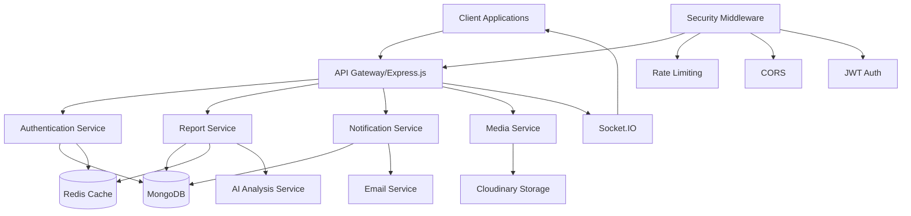

<div align="center">

# 🛡️ AntiCrime Backend API

<h3>A powerful, secure, and scalable crime reporting system API</h3>

[](https://www.typescriptlang.org/)
[](https://expressjs.com/)
[](https://www.mongodb.com/)
[](https://redis.io/)

</div>

<p align="center">
  <a href="#features">Features</a> •
  <a href="#tech-stack">Tech Stack</a> •
  <a href="#getting-started">Getting Started</a> •
  <a href="#api-endpoints">API Endpoints</a> •
  <a href="#contributing">Contributing</a>
</p>

## ✨ Features

<details>
<summary>🔐 Authentication & Authorization</summary>

- Secure JWT-based authentication
- Role-based access control (Admin/User)
- Military-grade password encryption
- Automated password reset workflow
- Email verification system
</details>

<details>
<summary>💾 Data Management</summary>

- MongoDB integration with Mongoose ODM
- Advanced query builder with filtering, sorting, and pagination
- Redis caching for lightning-fast performance
- Cloudinary integration for media handling
</details>

<details>
<summary>🛡️ Security</summary>

- CORS protection
- Rate limiting
- Input sanitization
- Secure HTTP headers
- XSS protection
</details>

<details>
<summary>🔍 Error Handling</summary>

- Comprehensive global error handling
- Schema validation using Zod
- Custom error classes
- Detailed error responses
</details>

## 🚀 Tech Stack

<table>
  <tr>
    <td align="center" width="96">
      
      <br>Node.js
    </td>
    <td align="center" width="96">
      
      <br>TypeScript
    </td>
    <td align="center" width="96">
      
      <br>MongoDB
    </td>
    <td align="center" width="96">
      
      <br>Redis
    </td>
  </tr>
</table>

## 🚦 Getting Started

### Prerequisites

```bash
Node.js >= v16
MongoDB
Redis
npm/yarn/bun
```

### Installation

1️⃣ Clone the repository

```bash
git clone https://github.com/abujobayer0/anti-crime-server.git && cd anti-crime-server
```

2️⃣ Install dependencies

```bash
bun install  # or npm install / yarn install
```

3️⃣ Configure environment

```bash
cp .env.example .env
# Edit .env with your configuration
```

4️⃣ Start development server

```bash
bun dev  # or npm run dev / yarn dev
```

## 🔌 API Endpoints

### 🔐 Authentication Routes

| Method | Endpoint                       | Description                     |
| ------ | ------------------------------ | ------------------------------- |
| `POST` | `/api/v1/auth/register`        | Register new user               |
| `POST` | `/api/v1/auth/login`           | User login                      |
| `POST` | `/api/v1/auth/reset-link`      | Request password reset          |
| `POST` | `/api/v1/auth/forgot-password` | Reset password                  |
| `POST` | `/api/v1/auth/change-password` | Change password (Auth required) |

### 📝 Crime Report Routes

| Method   | Endpoint                                  | Description           |
| -------- | ----------------------------------------- | --------------------- |
| `GET`    | `/api/v1/reports`                         | Get all reports       |
| `GET`    | `/api/v1/reports/query`                   | Search/query reports  |
| `GET`    | `/api/v1/reports/recent-reports`          | Get last 24h reports  |
| `GET`    | `/api/v1/reports/user-reports`            | Get user's reports    |
| `GET`    | `/api/v1/reports/profile-reports/:userId` | Get user's reports    |
| `GET`    | `/api/v1/reports/:id`                     | Get specific report   |
| `POST`   | `/api/v1/reports`                         | Create new report     |
| `POST`   | `/api/v1/reports/analyze`                 | Analyze report images |
| `PATCH`  | `/api/v1/reports/:id`                     | Update report         |
| `DELETE` | `/api/v1/reports/:id`                     | Delete report         |
| `POST`   | `/api/v1/reports/:id/upvote`              | Toggle upvote         |
| `POST`   | `/api/v1/reports/:id/downvote`            | Toggle downvote       |

### 💬 Comment Routes

| Method   | Endpoint                    | Description    |
| -------- | --------------------------- | -------------- |
| `POST`   | `/api/v1/:reportId/comment` | Add comment    |
| `PATCH`  | `/api/v1/:commentId/update` | Update comment |
| `DELETE` | `/api/v1/:commentId/delete` | Delete comment |

### 👥 Followers Routes

| Method | Endpoint                                    | Description             |
| ------ | ------------------------------------------- | ----------------------- |
| `GET`  | `/api/v1/followers`                         | Get followers/following |
| `GET`  | `/api/v1/followers/check-follow-status/:id` | Check follow status     |
| `POST` | `/api/v1/followers/follow/:id`              | Follow user             |
| `POST` | `/api/v1/followers/unfollow/:id`            | Unfollow user           |

### 🔔 Notification Routes

| Method   | Endpoint                         | Description         |
| -------- | -------------------------------- | ------------------- |
| `GET`    | `/api/v1/notifications`          | Get notifications   |
| `PATCH`  | `/api/v1/notifications/:id/read` | Mark as read        |
| `PATCH`  | `/api/v1/notifications/read-all` | Mark all as read    |
| `DELETE` | `/api/v1/notifications/:id`      | Delete notification |

> **Note**: All routes except public authentication endpoints require JWT authentication. Routes are protected with role-based access control (RBAC) for either `user` or `admin` roles.

## 🛠️ Development

```bash
# Build project
bun run build

# Production start
bun start:prod

# Linting
bun run lint
bun run lint:fix

# Formatting
bun run prettier
bun run prettier:fix
```

## 🤝 Contributing

We welcome contributions! Please follow these steps:

1. Fork the repository
2. Create your feature branch (`git checkout -b feature/AmazingFeature`)
3. Commit changes (`git commit -m 'Add AmazingFeature'`)
4. Push to branch (`git push origin feature/AmazingFeature`)
5. Open a Pull Request

## 📄 License

This project is licensed under the ISC License.

<div align="center">

## 👨‍💻 Author

**Abu Talha Md Jobayer**

[](https://github.com/abujobayer0)
[](https://www.linkedin.com/in/abutalhamdjobayer/)

<p align="center">⭐ Star this repository if you find it helpful!</p>

</div>

## 🏗️ System Architecture



### Architecture Components

<details>
<summary>🌐 Client Interface Layer</summary>

- REST API Endpoints
- WebSocket Connections
- Real-time Updates
- Request/Response Handling
</details>

<details>
<summary>🔐 Security Layer</summary>

- JWT Authentication
- Rate Limiting
- CORS Protection
- Input Validation
</details>

<details>
<summary>🛠️ Core Services</summary>

- Authentication Service
- Report Management
- Notification System
- Media Processing
</details>

<details>
<summary>💾 Data Management</summary>

- MongoDB Database
- Redis Caching
- Data Persistence
- Query Optimization
</details>

<details>
<summary>🔌 External Integrations</summary>

- Cloudinary Storage
- Email Service
- AI Analysis
- Push Notifications
</details>

### Key Features

- **Scalable Architecture**: Microservices-ready design
- **Real-time Updates**: Socket.IO integration
- **Caching Strategy**: Redis implementation
- **Security First**: Multiple security layers
- **Cloud Storage**: Efficient media handling
- **AI Integration**: Automated report analysis
